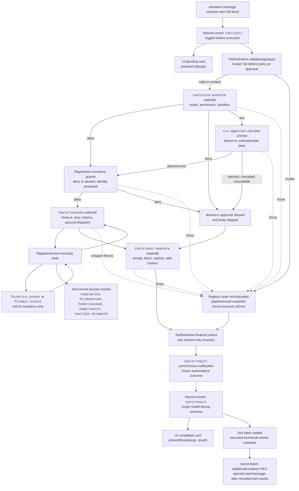

<!-- Generated by scripts/gen-doc-graphs.ts - do not edit by hand.
     Run `pnpm run gen-doc-graphs` to regenerate. -->

# Tool Execution Pipeline

This graph shows where argument validation, policy, hooks, sandboxing, filesystem guards, result rewriting, final-outcome observation, and UI rendering run without changing the loop. Definition-owned preflight validation runs before the `tools/pre-execute` waterfall or approval can observe a call. Monotonic guards, the `tools/execute` and `tools/post-execute` waterfalls, definition-owned `finalizeContent`, and `tools/result` follow.

Filesystem read-before-edit checks stay below `tool-fs` on `fs/*` events. Generic pre/post waterfalls host hooks and approval policy; `ctx.approval` resolves asks before monotonic guards, and owner policy that must not be reordered remains a registered guard. Around-dispatch concerns such as timeouts wrap `tools/execute`. The registry losslessly snapshots the candidate result and normalizes a snapshot failure before the visible definition's snapshotted `finalizeContent` callback enforces its synchronous content-only invariant. `tools/result` then observes the immutable, lossless-JSON outcome. This lets hooks span tool families without coupling the tools to one policy service. PTC mode sends both the reserved `run_code` transport and its serialized sub-calls through the pipeline; sub-calls carry the parent token, log `tool/ptc-dispatch`, return denials as binding rejections, and omit `additionalContexts` to preserve call/result adjacency.

Maintenance mode: curated Mermaid flow; exact tool schemas and event signatures live in generated catalogs.
